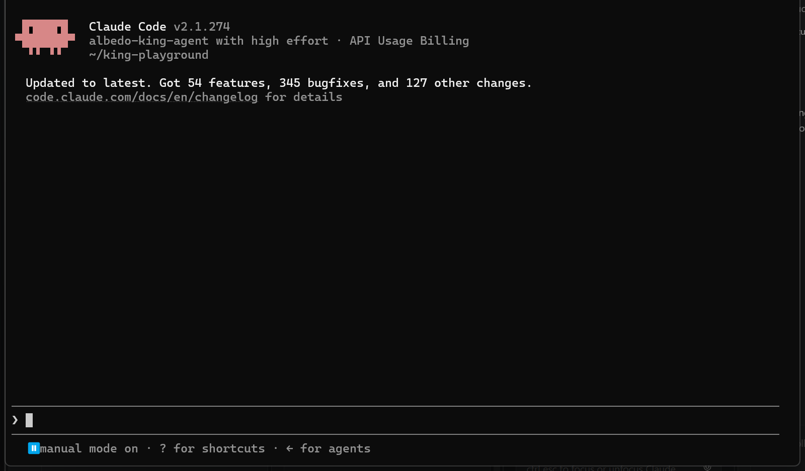

# Claude Code — terminal `claude`

Claude Code with the king as the model: the full Claude Code loop (Bash tool, permission prompts, `CLAUDE.md`,
compaction) runs against the king instead of Anthropic's models.

Same configuration file as the [VS Code extension](vscode-extension.md); this page covers the terminal.

## Requirements

- Claude Code CLI (`claude --version` works). Any recent version; no Anthropic subscription needed for the king.
- Your key in the `sk-ant-api03-…` spelling (see [the main page](../README.md#create-an-account-and-get-a-key)).

## Steps

Claude Code speaks the Anthropic Messages API, and the king endpoint serves it directly. Everything is set with
environment variables. Two ways to set them; use one.

### A. Per project (recommended)

1. In the repository you want to work in, create `.claude/settings.local.json` (local, not committed):

   ```json
   {
     "model": "albedo-king-agent",
     "env": {
       "ANTHROPIC_BASE_URL": "https://api.albedo.tech",
       "ANTHROPIC_AUTH_TOKEN": "sk-ant-api03-…",
       "ANTHROPIC_MODEL": "albedo-king-agent",
       "ANTHROPIC_DEFAULT_OPUS_MODEL": "albedo-king-agent",
       "ANTHROPIC_DEFAULT_SONNET_MODEL": "albedo-king-agent",
       "ANTHROPIC_DEFAULT_HAIKU_MODEL": "albedo-king-agent",
       "CLAUDE_CODE_MAX_CONTEXT_TOKENS": "131072",
       "CLAUDE_CODE_DISABLE_NONESSENTIAL_TRAFFIC": "1"
     }
   }
   ```

   Add `.claude/settings.local.json` to `.gitignore` if it is not already; it holds the key.

2. Run `claude` in that folder. The header shows `albedo-king-agent` as the model and the footer warns that
   claude.ai connectors are disabled because another auth source is set. Both are expected; your global login
   and other projects are untouched.

   

### B. Per shell

```bash
export ANTHROPIC_BASE_URL=https://api.albedo.tech
export ANTHROPIC_AUTH_TOKEN=sk-ant-api03-…
export ANTHROPIC_MODEL=albedo-king-agent
export ANTHROPIC_DEFAULT_OPUS_MODEL=albedo-king-agent
export ANTHROPIC_DEFAULT_SONNET_MODEL=albedo-king-agent
export ANTHROPIC_DEFAULT_HAIKU_MODEL=albedo-king-agent
export CLAUDE_CODE_MAX_CONTEXT_TOKENS=131072
claude --model albedo-king-agent
```

Put the block in a small wrapper script (for example `~/bin/king-claude`) so `claude` alone keeps using your
normal account.

What the variables do: `ANTHROPIC_BASE_URL` points Claude Code at the king; `ANTHROPIC_AUTH_TOKEN` is the key
(not `ANTHROPIC_API_KEY`, which Claude Code treats differently); the three `DEFAULT_*_MODEL` variables route
Claude Code's background calls (titles, summaries, sub-agents) to the king as well; `CLAUDE_CODE_MAX_CONTEXT_TOKENS`
must be **your tier's prompt cap** (131,072 on standard, 262,144 on miner), not the engine's context: Claude Code
compacts when it nears this number, and the gateway refuses any request above the cap, so a larger value ends the
session with a `400` instead of a compaction. The keys page fills the right number into the snippet for your tier.
Use `albedo-king` instead of `albedo-king-agent` for a chat-only session where nothing should run.

## Verify

```bash
claude -p "Which king are you?" --output-format text
```

prints a short answer naming the king. Then, in a scratch folder:

```bash
claude -p "Create hello.txt containing hi, then show it." --allowedTools Bash --output-format text
```

runs one `Bash` command and prints `hi`. Interactively you see Claude Code's usual permission prompt for the
command.

## Known limits on this surface

- **Only the Bash tool is used.** Read, Edit, Grep, Glob, WebFetch, sub-agents and MCP tools are never called
  by the king; it reads and writes through the shell. `--allowedTools Bash` is all you need in print mode.
- **The model picker** (`/model`) lists Anthropic's names. Ignore it; the request goes to the king. The status
  line shows `albedo-king-agent`.
- **Instructions files pass through.** Your `CLAUDE.md` and the Claude Code system prompt reach the king
  unchanged. Very long ones eat into the prompt cap.
- **Preamble stalls.** Occasionally the king answers "I'll check the files…" and stops; the gateway retries once.
  If nothing runs, type `go ahead`.
- **Windows:** Claude Code's Bash tool runs Git Bash; the king writes bash there, which is fine.

## Problems

Go back to [Troubleshooting on the main page](../README.md#troubleshooting). Claude-Code-specific `401`:
the key must be in `ANTHROPIC_AUTH_TOKEN`, and `ANTHROPIC_BASE_URL` must have no trailing `/v1`.
