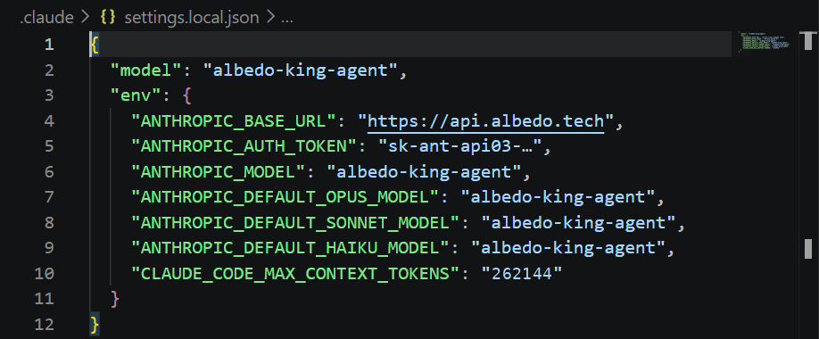
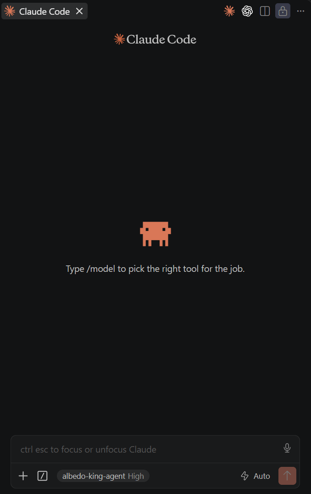
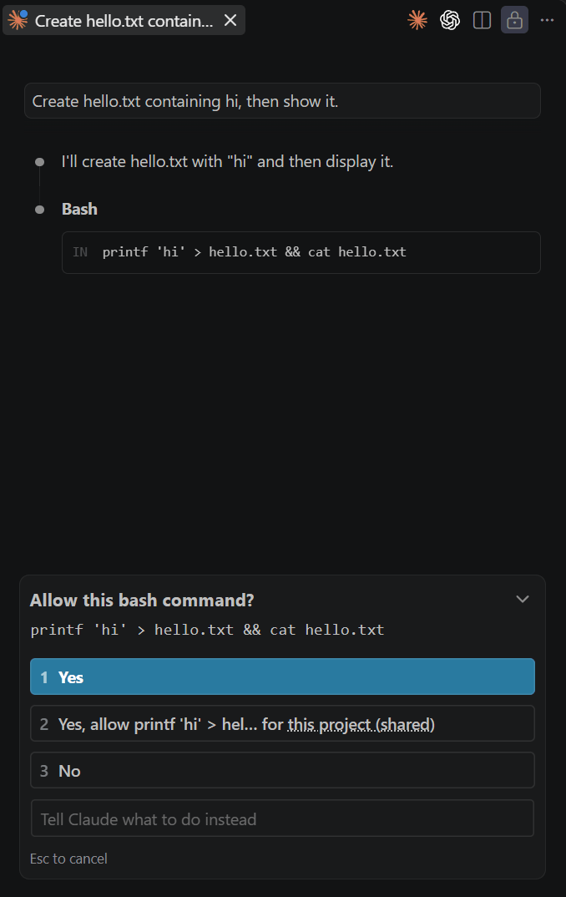
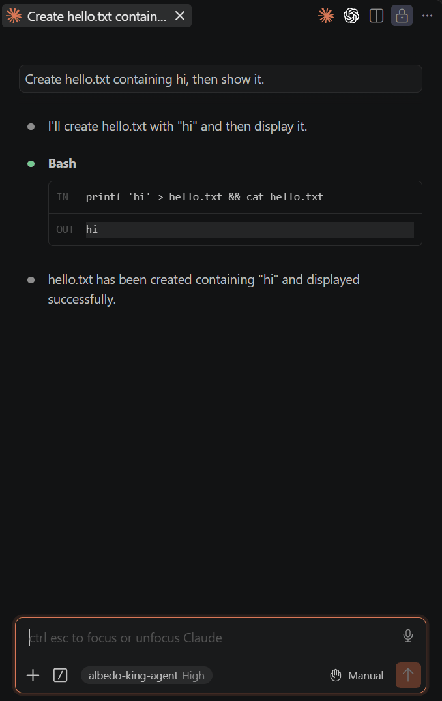

# Claude Code — VS Code extension

The Claude Code panel in VS Code (extension `anthropic.claude-code`) with the king as the model. The extension
runs the bundled Claude Code CLI inside your workspace, so the setup is the same file as for the
[terminal](cli.md), only opened from the editor.

## Requirements

- VS Code with the **Claude Code** extension installed (it bundles the CLI).
- Your key in the `sk-ant-api03-…` spelling (see [the main page](../README.md#create-an-account-and-get-a-key)).

## Steps

1. Open the folder you want to work in (**File → Open Folder**).

2. Create `.claude/settings.local.json` in that folder with:

   ```json
   {
     "model": "albedo-king-agent",
     "env": {
       "ANTHROPIC_BASE_URL": "https://api.albedo.tech",
       "ANTHROPIC_AUTH_TOKEN": "sk-ant-api03-…",
       "ANTHROPIC_MODEL": "albedo-king-agent",
       "ANTHROPIC_DEFAULT_OPUS_MODEL": "albedo-king-agent",
       "ANTHROPIC_DEFAULT_SONNET_MODEL": "albedo-king-agent",
       "ANTHROPIC_DEFAULT_HAIKU_MODEL": "albedo-king-agent",
       "CLAUDE_CODE_MAX_CONTEXT_TOKENS": "131072"
     }
   }
   ```

   `CLAUDE_CODE_MAX_CONTEXT_TOKENS` is your tier's prompt cap (131,072 on standard, 262,144 on miner); Claude Code
   compacts when it nears it, and the gateway refuses requests above it. The CLI applies the `env` block of the
   project settings on every start. Only this workspace is affected; your
   Claude Code login and other folders keep using Anthropic. `settings.local.json` is ignored by git by Claude
   Code's convention; if you prefer a shared `.claude/settings.json`, leave the key out of it and keep only
   `ANTHROPIC_AUTH_TOKEN` in the local file.

   

3. Open the Claude Code view (the Claude icon in the activity bar, or `Ctrl+Escape`) and click **New session**.
   The session opens beside your editor with `albedo-king-agent` shown under the input box. If a session was
   already open, start a new one so the settings are re-read.

   

4. Send a task. In **Manual** mode (the mode switch is next to the send button; **Auto** approves safe commands
   by itself) each shell command appears as a **Bash** step asking for permission, exactly as with Anthropic's
   models. After you allow it the output and the king's summary follow.

   

   

## Verify

Type `Which king are you?` → a streamed answer naming the king. Then, in a scratch workspace:
`Create hello.txt containing hi, then show it.` → one Bash approval, then `hi` in the output and the file in
the Explorer.

## Known limits on this surface

- **Bash only.** The king does not use Read / Edit / Grep or MCP tools, so the extension's inline diff view for
  edits does not appear; changes show up after the command ran. See [the main page](../README.md#what-to-expect).
- **Model picker** in the panel shows Anthropic's names; the request still goes to the king.
- **Windows:** the Bash tool is Git Bash; the king writes bash for it. Remote-WSL workspaces work the same way.
- **Two Claude Code sessions in parallel** hit the standard tier's limit of 2 concurrent requests as soon as both are
  generating; the second one shows the `429` text in the chat.

## Problems

Go back to [Troubleshooting on the main page](../README.md#troubleshooting). If the panel keeps using
Anthropic, the settings file is in the wrong folder (it must be `<workspace>/.claude/settings.local.json`) or the
session predates the file.
