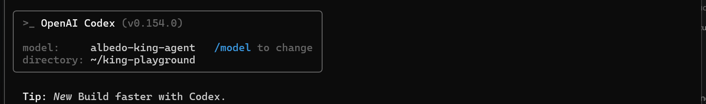

# Codex — terminal `codex`

OpenAI's Codex CLI with the king as the model: the Codex TUI, its sandbox and approval flow run the king's shell
commands.

Same `config.toml` as the [VS Code extension](vscode-extension.md); this page covers the terminal.

## Requirements

- Codex CLI 0.150 or newer (`npm install -g @openai/codex`; `codex --version`). Older versions with
  `wire_api = "chat"` are not supported — the king endpoint serves Codex through the Responses API.
- Your key in the `sk-…` spelling (see [the main page](../README.md#create-an-account-and-get-a-key)).
- No OpenAI account or ChatGPT login is needed for a custom provider.

## Steps

1. Add a provider and make it the default in `~/.codex/config.toml` (create the file if missing):

   ```toml
   model = "albedo-king-agent"
   model_provider = "albedo"
   model_context_window = 131072
   model_max_output_tokens = 8192

   [model_providers.albedo]
   name = "Albedo king"
   base_url = "https://api.albedo.tech/v1"
   env_key = "ALBEDO_API_KEY"
   wire_api = "responses"
   ```

   `model_context_window` is your tier's prompt cap (131,072 on standard, 262,144 on miner): Codex compacts when
   it nears it, and the gateway refuses requests above it. `env_key` names the environment variable Codex reads the
   key from. If you would rather keep the key in the
   file, replace the `env_key` line with `http_headers = { Authorization = "Bearer sk-…" }`.

2. Export the key in your shell profile:

   ```bash
   export ALBEDO_API_KEY=sk-…
   ```

3. Start Codex in a project folder:

   ```bash
   codex
   ```

   The header shows model `albedo-king-agent` and your directory. Codex also reports *1 startup issue*: the
   harmless "model metadata not found" warning for a model outside OpenAI's catalogue.

   

Prefer to keep your OpenAI default? Put the king in a profile. Since Codex 0.154 a profile is its own file,
`~/.codex/king.config.toml` (a `[profiles.king]` table inside `config.toml` is rejected at start-up):

```toml
model = "albedo-king-agent"
model_provider = "albedo"
model_context_window = 131072
model_max_output_tokens = 8192
```

Keep the `[model_providers.albedo]` block in `config.toml` and start with `codex -p king`.

## Verify

Codex's own instructions tell the model it is Codex, so the king introduces itself as Codex when asked;
check the model in the TUI header or with `/status` instead. Then, in a scratch folder:

```bash
codex exec --skip-git-repo-check "Create hello.txt containing hi, then print it."
```

runs one shell command (approval according to your sandbox settings) and prints `hi`. In the TUI, `/status`
shows the real provider and model.

## Known limits on this surface

- **Network is restricted in the default sandbox.** Codex declares that to the model, so the king correctly
  refuses tasks that need `curl` or `pip install`. Allow it per project when you need it:

  ```toml
  [sandbox_workspace_write]
  network_access = true
  ```

- **`/model` lists OpenAI's catalogue only.** Press Esc; picking one of those names still sends the request to
  the king (the endpoint serves every model name).
- **Thread titles** are generated by a side request that Codex sends with a hardcoded OpenAI model name. The
  king answers it too; you may notice a second, tiny request per thread.
- **Preamble stalls.** Codex asks the model for a short sentence before each command; the king sometimes stops
  after that sentence. The gateway retries once; if nothing runs, type `continue`.
- **Only the shell tool.** Codex's `apply_patch` is not used; the king edits files with shell commands.
- **"I'm Codex."** Asked who it is, the king answers in the persona Codex's system prompt gives it. Use
  `/status` or the header to see the real model.

## Problems

Go back to [Troubleshooting on the main page](../README.md#troubleshooting). Codex-specific: a `401` right
after start usually means `ALBEDO_API_KEY` is not exported in the shell that launched `codex`, or `base_url`
misses the `/v1`.
