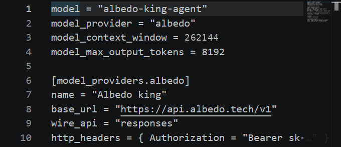
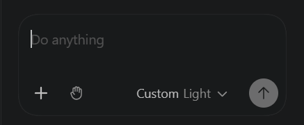

# Codex — VS Code extension

The Codex panel in VS Code (extension `openai.chatgpt`) with the king as the model. The extension shares the
CLI's `~/.codex/config.toml`, so if you set up the [terminal](cli.md) already, the panel follows it after a
window reload. Two extension-specific details are below: the key must be in the file, and the sign-in gate.

## Requirements

- VS Code with the **Codex** extension (`openai.chatgpt`) installed.
- Your key in the `sk-…` spelling (see [the main page](../README.md#create-an-account-and-get-a-key)).

## Steps

1. Create or edit `~/.codex/config.toml` (Windows: `%USERPROFILE%\.codex\config.toml`):

   ```toml
   model = "albedo-king-agent"
   model_provider = "albedo"
   model_context_window = 131072
   model_max_output_tokens = 8192

   [model_providers.albedo]
   name = "Albedo king"
   base_url = "https://api.albedo.tech/v1"
   wire_api = "responses"
   http_headers = { Authorization = "Bearer sk-…" }
   ```

   `model_context_window` is your tier's prompt cap (131,072 on standard, 262,144 on miner). The key goes in `http_headers`: a GUI process does not see the environment variables of your shell, so
   `env_key` does not work here.

   

2. The extension insists on a signed-in state before it talks to any provider. Satisfy it without an OpenAI
   account by creating `~/.codex/auth.json` next to the config:

   ```json
   {"OPENAI_API_KEY": "sk-…"}
   ```

   using the same `sk-…` king key.

3. **Developer: Reload Window** (Command Palette), then open the **Codex** view (the OpenAI icon in the editor
   toolbar or the secondary side bar). Its model selector reads **Custom** for a model outside OpenAI's
   catalogue; that is the king.

   

4. Send a task. Each command shows up as a shell step with Codex's approval controls.

## Verify

Asked who it is the king answers as Codex (Codex's own instructions say so), so verify with a task. In a
scratch workspace: `Create hello.txt containing hi,
then print it.` → one approved command, `hi` in the output, the file in the Explorer.

## Known limits on this surface

- **Remote-WSL workspaces** read the WSL `~/.codex/config.toml`, local Windows folders read the Windows one.
  Set up both if you use both.
- The panel's model selector shows **Custom** rather than the model name; the CLI header or `/status` shows
  `albedo-king-agent`.
- Same as the CLI: restricted network in the default sandbox, thread-title side request, shell tool only. See
  [cli.md](cli.md#known-limits-on-this-surface).

## Problems

Go back to [Troubleshooting on the main page](../README.md#troubleshooting). Extension-specific: a sign-in
screen means step 2 is missing; a `401` in the panel means the header in step 1 has a stale key.
