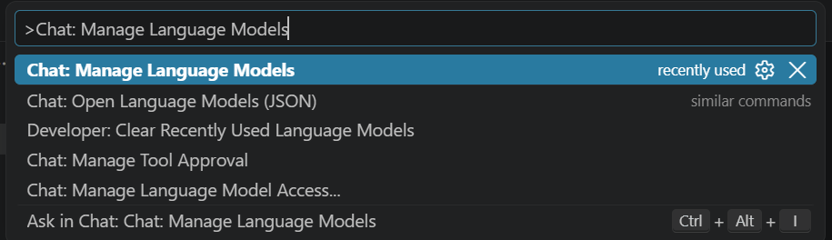
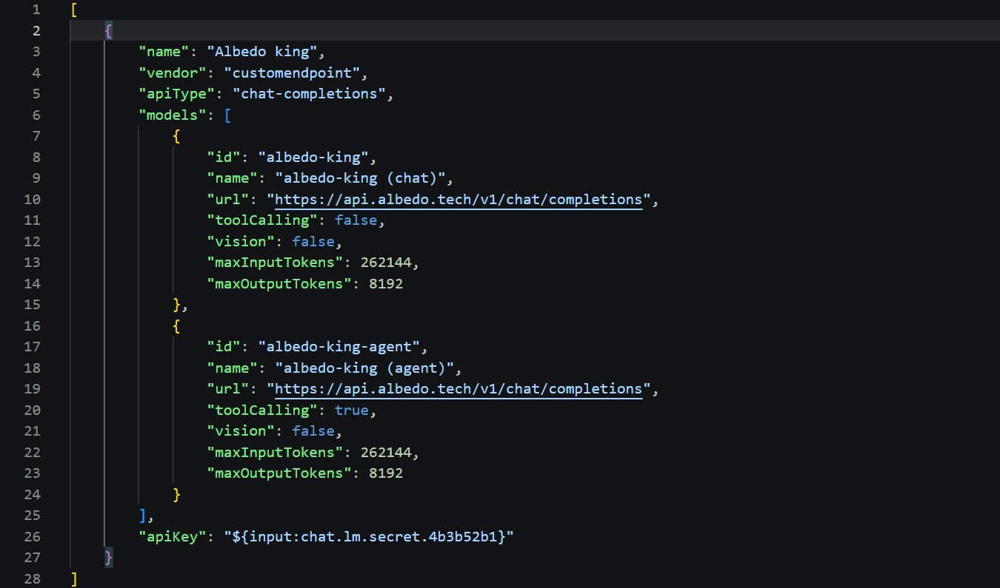
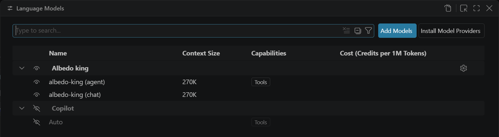
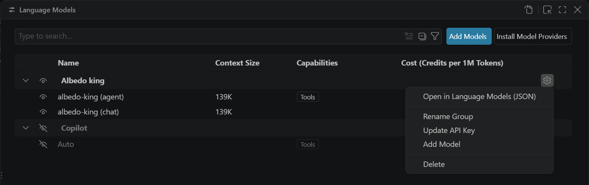
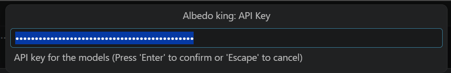
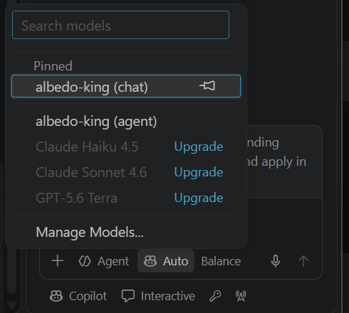

# GitHub Copilot Chat in VS Code

Copilot Chat with the king as a "bring your own key" model: chat in **Ask** mode with `albedo-king`, or let
**Agent** mode run the king's commands in the VS Code terminal with `albedo-king-agent`.

## Requirements

- VS Code 1.136 or newer with the GitHub Copilot Chat extension 0.64 or newer (the **Custom endpoint** provider
  in *Manage Language Models*).
- A GitHub account signed in to Copilot (any plan, including Free — the custom endpoint does not use Copilot
  quota).
- Your key in the `sk-…` spelling (see [the main page](../README.md#create-an-account-and-get-a-key)).

## Steps

1. Open the Command Palette (`Ctrl+Shift+P`) and run **Chat: Open Language Models (JSON)** (it sits next to
   **Chat: Manage Language Models…**).

   

2. VS Code opens `chatLanguageModels.json` from your VS Code *User* folder. Replace its contents with:

   ```json
   [
     {
       "name": "Albedo king",
       "vendor": "customendpoint",
       "apiType": "chat-completions",
       "models": [
         {
           "id": "albedo-king",
           "name": "albedo-king (chat)",
           "url": "https://api.albedo.tech/v1/chat/completions",
           "toolCalling": false,
           "vision": false,
           "maxInputTokens": 131072,
           "maxOutputTokens": 8192
         },
         {
           "id": "albedo-king-agent",
           "name": "albedo-king (agent)",
           "url": "https://api.albedo.tech/v1/chat/completions",
           "toolCalling": true,
           "vision": false,
           "maxInputTokens": 131072,
           "maxOutputTokens": 8192
         }
       ],
       "apiKey": "${input:chat.lm.secret.albedo}"
     }
   ]
   ```

   `maxInputTokens` is your tier's prompt cap (131,072 on standard, 262,144 on miner); Copilot trims history to it,
   and the gateway refuses requests above it. Keep `apiKey` exactly as a `${input:chat.lm.secret.…}` reference. A key pasted in plain text is silently
   treated as missing. Save the file.

   

3. Run **Chat: Manage Language Models…**. The **Language Models** editor now lists the group *Albedo king* with
   both models.

   

4. Click the gear at the right end of the *Albedo king* row and choose **Update API Key**. Paste the `sk-…` key
   and press Enter. VS Code stores it in its secret storage, not in the JSON file.

   

   

5. Open the Chat view (`Ctrl+Alt+I`) and click the model name at the bottom of the input box. Both king models
   are listed; pin the one you use most.

   

Optional: make it the default for new chats in `settings.json`:

```json
"chat.defaultModel": "albedo-king"
```

## Verify

Ask mode, model **albedo-king (chat)**: type `Which king are you?` → a streamed answer naming the king.

Agent mode, model **albedo-king (agent)**, in a scratch folder: `Create hello.txt containing hi, then show
it.` → Copilot asks you to run one terminal command, runs it, and the king reports the content.

## Known limits on this surface

- **Key re-entry.** The key lives in VS Code's secret storage, not in the JSON file. After a key rotation, a new
  machine or a Settings Sync restore, repeat step 4 (gear → Update API Key). A `401` in the chat is the sign.
- **Agent mode uses only the terminal tool.** Copilot's edit tools are not used by the king; files are written
  with shell commands. On Windows the tool runs **Windows PowerShell 5**, and the king is told so; open the
  folder through Remote-WSL if you want bash.
- **Ask mode with the agent model** and **Agent mode with the chat model** both work, but the wrong way round:
  the chat model in Agent mode only describes commands. Use the pairing above.
- Copilot sends its own 17–30 KB system prompt and tool list with every message. It counts toward the prompt
  cap, not toward your daily quota.
- Inline completions (ghost text) stay on GitHub's models; the custom endpoint covers Chat only.

## Problems

Go back to [Troubleshooting on the main page](../README.md#troubleshooting). Copilot-specific `401` almost
always means the secret from step 4 is missing or stale.
