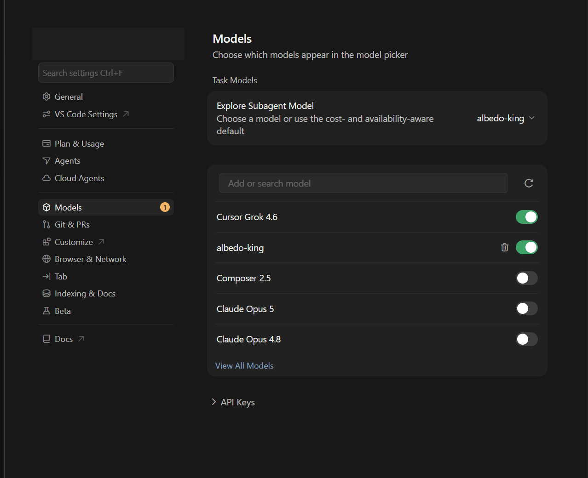
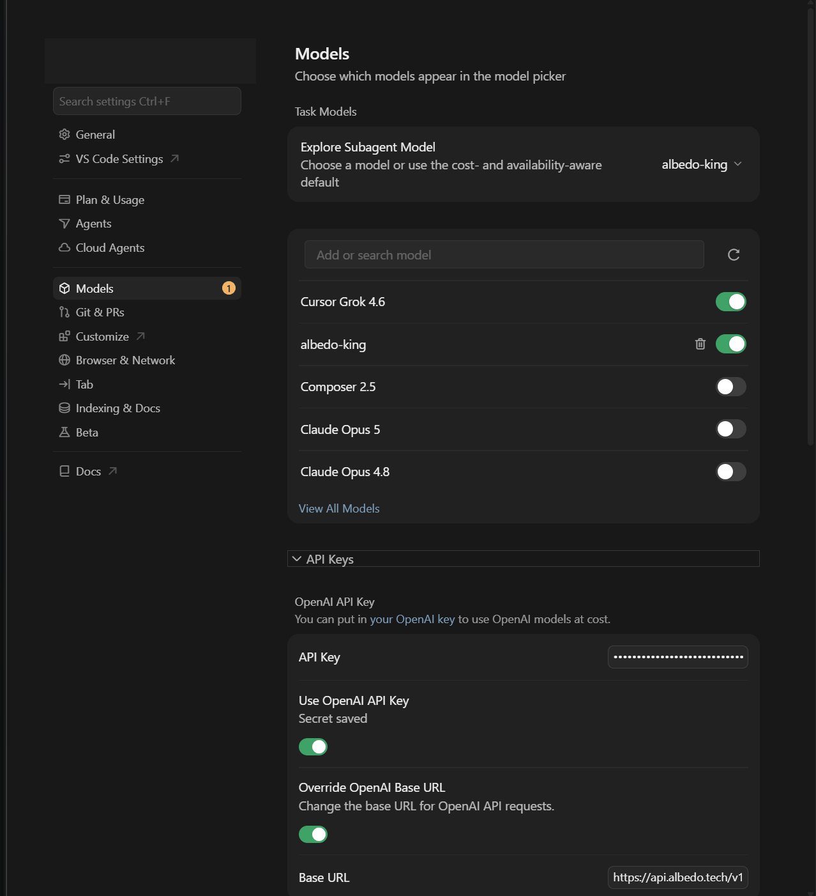
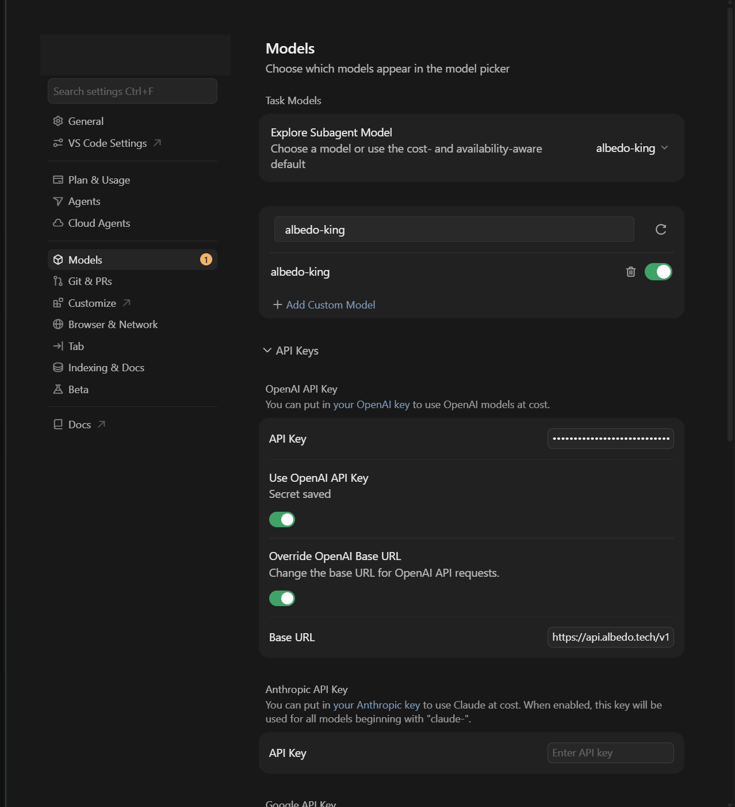
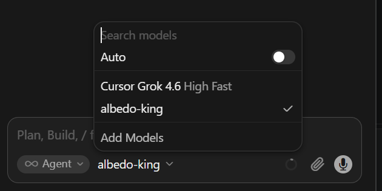

# Cursor IDE

Cursor's chat and Agent mode with the king as the model: Ask questions in the chat pane, or let Agent mode run
the king's shell commands with Cursor's own approval UI.

## Requirements

- Cursor **Pro** (or higher). The free plan refuses any named or custom model ("Free plans can only use Auto").
- Cursor 3.x. Cursor's servers call the API on your behalf, so only the public `https://api.albedo.tech` works —
  no localhost or VPN-only address.
- Your key in the `sk-…` spelling (see [the main page](../README.md#create-an-account-and-get-a-key)).

## Steps

1. Open **Cursor Settings** (`Ctrl+Shift+J` / `Cmd+Shift+J`) and pick **Models** in the left column.

   

2. Scroll to the bottom and expand **API Keys**. Under *OpenAI API Key*:

   - paste the `sk-…` key into **API Key**;
   - switch **Use OpenAI API Key** on (Cursor shows *Secret saved*);
   - switch **Override OpenAI Base URL** on and enter `https://api.albedo.tech/v1` in **Base URL**.

   There is no separate verify button; the key is checked on the first request.

   

3. Back at the top of **Models**, type `albedo-king` into **Add or search model** and click **+ Add Custom Model**.
   Make sure its toggle is on so it appears in the model picker. (Cursor's own OpenAI names are listed too;
   only `albedo-king` is meant for the king.)

   

4. Open the chat pane (`Ctrl+L` / `Cmd+L`) and choose `albedo-king` in the model picker at the bottom.

   

## Verify

Type `Which king are you?` in **Ask** mode. The reply names the king (for example "King CXXV") and streams
in within a few seconds.

Then switch to **Agent** mode, open a scratch folder and ask: `Create hello.txt containing hi, then show it.`
Cursor shows one **Shell** command for approval, runs it, and the king replies with the file content and a short
summary.

## Known limits on this surface

- **Agent mode works through the Shell tool only.** Cursor's own Read / Write / StrReplace tools are not used;
  the king writes files with shell commands. Cursor's diff view therefore shows changes after the command ran.
- **Windows:** Cursor runs PowerShell. The gateway reads that from Cursor's request and the king writes
  PowerShell (`Set-Content`, `Get-ChildItem`). If you see bash syntax anyway, say
  `You are in Windows PowerShell` once.
- **Only the editor chat** (`Ctrl+L`) offers custom models. Cursor's background agents window uses Cursor's
  own models.
- **Cursor's prompt is large** (about 30 KB per request). It counts toward the 131k prompt cap, not toward your
  daily quota.
- Custom models get no Cursor "Auto" routing, no Tab completions and no Cursor-side caching.

## Problems

Go back to [Troubleshooting on the main page](../README.md#troubleshooting). Cursor-specific: if the model
picker offers no `albedo-king`, check step 3 (the model must be added by exact name) and the plan (Pro).
